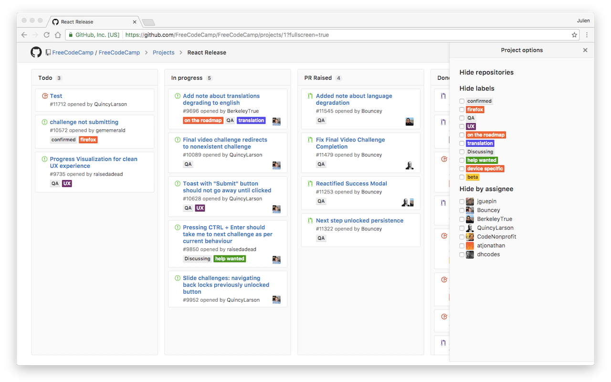

# GitHub Projects Options

Chrome extension adding options to GitHub Projects:
- Hide cards by repository / label / assignee
- Hide parts of the UI (Details, Settings, Add column)

### TODO
- Hide notes / issues / PR
- Go fullscreen by default
- Save those options in localStorage
- Group cards together
- Better UI
- Search cards

## Install

Install it from the [Chrome Web Store](https://chrome.google.com/webstore/detail/github-projects-options/pmkiiheepcolpokabbgdkfciocanaifh) or [manually](http://superuser.com/a/247654/6877).

## Screenshot

## License

[MIT License](LICENSE.md) © [Julien Guepin](http://guep.in)

Inspired by [Refined GitHub](https://github.com/sindresorhus/refined-github)
